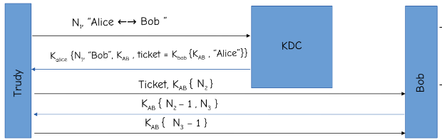

# Secure Internet Relay Chat (IRC)

## System Design

* Authentication Using Needham Schroedhar:

The server and the user are authenticated using the NS authentication scheme as shown in the above diagram. THey first authenticate themselves using the KDC server and then obtain a ticket to communicate with the chat server.

* After authentication, a client-server architecture for each of the commands maintained. All the commands perform their desired functionality.

* For the group chat feature, there is a Diffie Hellman Key exchange between all the parties of the group. The library used for this is the `OpenSSL libcrypto` library. The design is as follows:
  * The owner of the group runs the command `/init_group_dhxchg`. 
  * All the members are requested for their public key.
  * At the same time, the owner also sends its public key for DH.
  * The key for first member is computed at both ends and then verified at the owner end as the other member sends its computed key along with its hash.
  * The previously computed key acts as public key for next user which again computes the new key. This is also verfied. The key is sent to the user by encrypting with its public key to ensure that only the targeted user can decrypt that key.
  * This happens sequentially for all the members and the final key is then communicated to the members for commnunication by encrypting with their public key and by owner's private key.

## Handled Vulnerabilities

The following are the major vulnerabilities that have been handled and can easily be demonstrated:

### 1. Buffer Overflow

This has been prevented by using `strncpy` instead of `strcpy` by defining the max size of copying that is done. Also the size of the inputs is checked to ensure that they are not of very large size that may cause buffer overflow. Most of the initializations have been static with pre-defined buffer size and  in other places there is proper size-controlled use of `malloc`.

### 2. Brute Forced Authentication

I have prevented Brute forcing of password by just allowing 3 unsuccessful attempts of authentication. 

### 3. Stack Smashing Error

I faced a stack smashing error on using the encrypted ticket inside another structure. This was handled for all the structures by increasing the buffer size by at least 1 for all the buffers placed in the structures. These buffers were initialized by '\0' to demarcate the end of the char buffer inside the structure. This ensured that there was no overlaping of the fields inside the structure and hence no stack smashing error.

The resolution was by sufficiently increasing the size of the buffers so that there can be clear demarkation between the fields inside the structure.

The following are the other preventions that have made the IRC system more robust to attacks:

* The key being used for communication in group chat is not being shared over the network itself. Instead it is being computed using Diffie Hellman. This prevents any leakage of the session key that is generated ensuring the parties involved in the communication are all validated against each other.

* The authentication is being done using Needham Schroedhar scheme. This ensures that the client (any of the users) and the server are mutually authenticated against one other.

* A new session key is generated for each client in each connection. This ensures further secure communication.

* Proper encryption while sending the key in doing multi-party Diffie Hellman

* There are several checks for each command ensuring the validity of memberships of group, whether the members are logged in, group validity, etc.

## Assumptions

* The group chat is encrypted only after running the command `/init_group_dhxchg`

* The sharing of public keys is trusted and this can be done without any encryption.

* `/init_group_dhxchg` can only be called by the owner of the group. This should be called once the members of the gorups are freezed and new member has to be added.

* The request for public key can only be sent to the logged in user.

* The message history is not saved in the system.

* There should be atleast 2 members in the group for calling the `init_group_dhxchg`

* `\write_all` command sends the message to all the logged in user at the same time. It does not send an encrypted message.